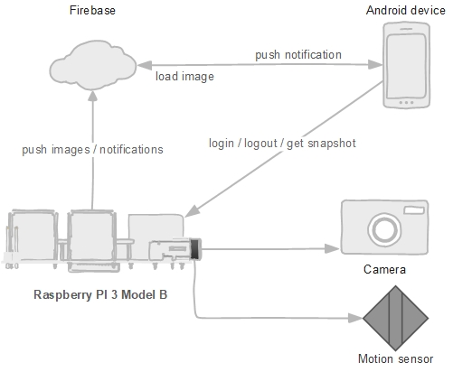

Home security with Rasperry PI
==============================
Thomas Herzog <herzog.thomas81@gmail.com>
v0.1, 2017/04/07, Initial intention description.

# Idea
This project realizes a home security application with a Raspberry Pi.
The Raspberry Pi hosts a Spring Boot application __(microservice)__ which represents the core software part of
this project. The Raspberry Pi is connected to a camera and a movement sensor and acts on a detected
movements. The Raspberry Pi itself will host the microservice represented by a Spring Boot
application which provides a REST-API for configuration purpose and push notifications to the connected clients.
Also the micoservice manages the connected sensors. +

An android admin app allows the owner of the security domain to configure the system and to register
users, who get notified if a security issue occurs. The by the owner of the security domain registered users will have the client app
installed on their android devices which are capable of receiving push notifications sent by the microservice
in case of an security issue. +

The clients are registered on the __Firebase Cloud Messaging (FCM)__ service provided by Google
and will get the notifications pushed to them via this service. The microservice acts
as the app server which manages the client apps which are part of the security domain. The microservice will
register and unregister clients and pushes notifications to them. +

# Hardware
The main hardware is a Raspberry Pi 3 Model B which hosts the microservice and has a movements sensor
and a camera connected to it. The hardware for the internet connection is already provided by the
Raspberry Pi. No further hardware is needed.

# Software
The main part of the software is the microservice implemented as a Spring Boot application which hosts the REST-API for the administrative tasks,
pushes notifications to the clients and interacts with the connected sensors. The library __PI4J__ For is used for interacting with the connected hardware.
As a database a __MongoDB__ server is used which holds the registered users, client applications and the recorded occurred security issues.
A __Nginx__ service is used as a reverse proxy to provide a secure SSL connection where the certificate is provided by __Letsencrypt-CA__.
Docker is used to isolate the service from each other and
to provide the possibility to deploy updates and upgrades for the database and spring boot application without the need to modify anything on the host. +

The __Firebase Cloud Messaging (FCW)__ service is used to push notifications to the registered clients of the users.

# System infrastructure
The following images shows the main infrastructure of this application. +

